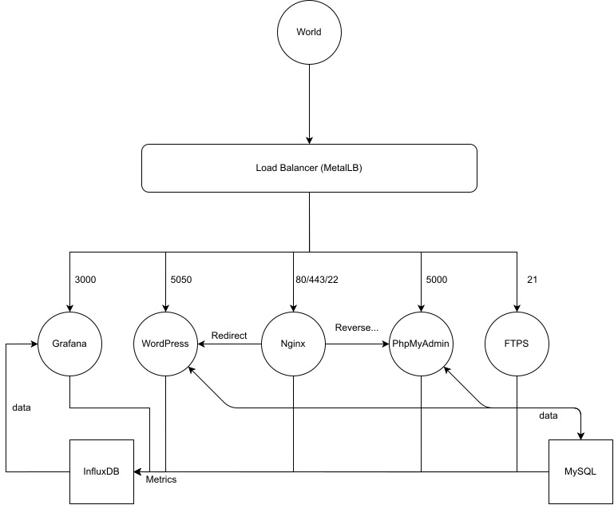

# 42Cursus-ft_services
This is a System Administration and Networking project. 

## Introduction:
Ft_services will introduce you to Kubernetes. You will discover cluster management and
deployment with Kubernetes. You will virtualize a network and do "clustering". 

### General Instructions:
- You must put all the necessary files for the configuration of your server in a folder called srcs. 
- Your setup.sh file should be at the root of your repository. This script will setup all your applications. 
- This subject requires both old and new practices. We therefore advise you not to be afraid to read a lot of documentation about Docker, Kubernetes, and all other things useful for the project. 

The project consists of setting up an infrastructure of different services. To do this, you must use Kubernetes. You will need to set up a multi-service cluster.
Each service will have to run in a dedicated container.
Each container must bear the same name as the service concerned and for performance reasons, containers have to be build using Alpine Linux.
Also, they will need to have a Dockerfile written by you which is called in the setup.sh.
You will have to build yourself the images that you will use. It is forbidden to take already build images or use services like DockerHub. 
You will also have to set up: 

- The Kubernetes web dashboard. This will help you manage your cluster. 

- The Load Balancer which manages the external access of your services. It will be the only entry point to your cluster. You must keep the ports associated with the service (IP:3000 for Grafana etc). Load Balancer will have a single ip. 

- A WordPress website listening on port 5050, which will work with a MySQL database.
Both services have to run in separate containers. The WordPress website will have several users and an administrator. Wordpress needs its own nginx server.

  - The Load Balancer should be able to redirect directly to this service. 

- phpMyAdmin, listening on port 5000 and linked with the MySQL database. PhpMyAdmin needs its own nginx server.
  -The Load Balancer should be able to redirect directly to this service. 

- A container with an nginx server listening on ports 80 and 443. Port 80 will be in http and should be a systematic redirection of type 301 to 443, which will be in https.
  - The page displayed does not matter as long as it is not an http error.
  - This container will allow access to a /wordpress route that makes a redirect 307 to IP:WPPORT.
  - It should also allow access to /phpmyadmin with a reverse proxy to IP:PMAPORT. 
- A FTPS server listening on port 21. 
- A Grafana platform, listening on port 3000, linked with an InfluxDB database. Grafana will be monitoring all your containers. You must create one dashboard per service. InfluxDB and grafana will be in two distincts containers. 
- In case of a crash or stop of one of the two database containers, you will have to make shure the data persist. 
- All your containers must restart in case of a crash or stop of one of its component parts. 

Make sure that each redirection toward a service is done using a load balancer. FTPS, Grafana, Wordpress, PhpMyAdmin and nginx’s kind must be "LoadBalancer". Influxdb and MySQL’s kind must be "ClusterIP". Other entries can be present, but none of them can be of kind "NodePort".

  Here is an example of what you will need to set up:

  

